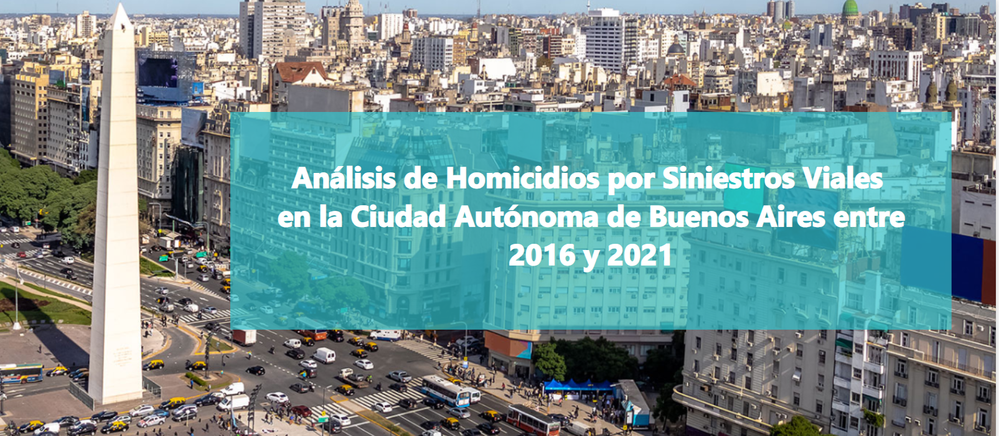
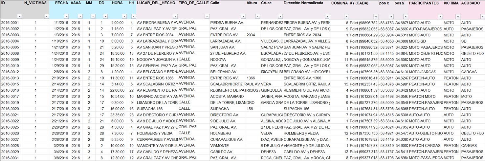
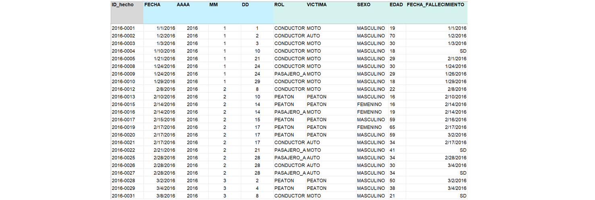
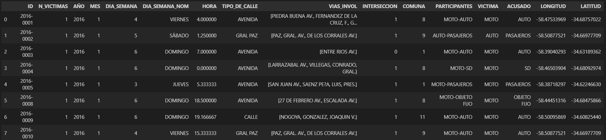

<h1 align='center'>
<b>Proyecto Individual 2 - Análisis y Visualización de Datos </b>
</h1>

## Descripcion General
A contInuación se presenta un proyecto de análisis de datos desarrollado a partir de un dataset sobre homicidios en siniestros viales que tuvieron lugar en la Ciudad Autónoma de Buenos Aires durante el periodo 2016-2021. Para este llevó a cabo un proceso de limpieza, transformación y normalización de datos para proceder a realizar un analisis exploratorio de datos y posteriormente un analisis exhaustivo de la problematica. Para finalizar, se realizó un dashboard explicativo en PowerBI en el cual se presentaron las conclusiones que se lograron extraer.

## Tabla de Contenido
1. [Descripción de la Estructura de Datos](#descripción-de-la-estructura-de-datos) 
    1.1. [Datos en bruto](#datos-en-bruto)  
    1.2. [Datos procesados](#datos-procesados) 
2. [Estructura del Proyecto](#estructura-del-proyecto) 
    2.1. [Carpetas](#carpetas)  
    2.2. [Notebooks](#notebooks) 
    2.3. [Archivos adicionales](#archivos-adicionales)  
3. [Contexto del Problema](#contexto-del-problema)  
4. [Objetivos Generales](#objetivos-generales)  
5. [Objetivos Especificos](#objetivos-especificos)  
    5.1. [KPI's](#kpis)
6. [Metodología](#metodologia) 
7. [Resultados](#resultados)  
    7.1. [Resultados KPI's](#resultados-kpis)  
8. [Conclusiones](#conclusiones)  
9. [Recomendacciones](#recomendaciones)  
10. [Herramientas implementadas](#herramientas-empleadas)  
11. [Disclaimer](#disclaimer)  

## Descripción de la Estructura de Datos

### Datos en bruto

Para este analisis se contó con 2 archivos que se encuentraban en formato xlsx: 
- [**homicidios.xlsx:**](Archivos%20Origen/homicidios.xlsx) El archivo con los datos a tratar, contiene dos hojas llamadas: hechos y víctimas.
- [**Diccionario de datos Siniestros viales.xlsx:**](Archivos%20Origen/Diccionario%20de%20datos%20Siniestros%20viales.xlsx) Es un archivo con el diccionario de datos para las dos tablas que se van a trabajar que sirve de guía para un mayor entendimiento de la data.

Las dos tablas con las que se inició el proyecto con las siguientes.

#### Hechos
Esta tabla contiene la informacion correspondiente a cada siniestro vial: fecha, ubicacion, numerode victimas y tipo de victima y acusado.

#### Victimas
Contiene la informacion de cada victima mortal (sexo, edad, tipo de victima, etc) y un indice que indica el siniestro en el cual falleció.

### Datos procesados
Una vez se realizó todo el proceso de ETL el analisis exploratorio de datos se realizó con las tablas que se explican a continuacion.

#### Hechos

1. **ID** - string   &emsp; Identificador unico del siniestro
2. **N_VICTIMAS** - int   &emsp; Cantidad de victimas mortales
3. **AÑO** - int   &emsp; Año del siniestro
4. **MES** - int   &emsp; Mes del siniestro
5. **DIA_SEMANA** - int   &emsp; Dia de la semana del siniestro
6. **DIA_SEMANA_NOM** - string   &emsp; Nombre del dia de la semana del siniestro
7. **HORA** - float   &emsp; Hora del siniestro
8. **TIPO_CALLE** - string   &emsp; Tipo de arteria (en el caso de intersecciones a nivel se clasifica según la de mayor jerarquía)
9. **VIAS_INVOL** - list   &emsp; Vias involucradas en el siniestro (la principal y el cruce en el caso de intersecciones a nivel)
10. **INTERSECCION** - int   &emsp; Indicador de si el siniestro ocurrió en una interseccion a nivel (1: Si, 0: No)
11. **COMUNA** - int   &emsp; Comuna de la ciudad en la que ocurrió el siniestro (1 a 15)
12. **PARTICIPANTES** - string   &emsp; Conjunción de víctima y acusado
13. **VICTIMA** - string   &emsp; Vehículo que ocupaba quien haya fallecido a se haya lastimado a raíz del hecho, o bien peatón/a. Clasificación agregada del tipo de vehículos.  
    - PEATON: Víctima distinta de cualquier ocupante de un vehículo, ya sea un conductor/a o un pasajero/a. Se incluyen los ocupantes o personas que empujan o arrastran un coche de bebé o una silla de ruedas o cualquier otro vehículo sin motor de pequeñas dimensiones. Se incluyen también las personas que caminan empujando una bicicleta o un ciclomotor.
    - MOTO: Vehículo a motor no carrozado que incluye motocicleta, ciclomotor y cuatriciclo.
    - AUTO: Vehículo a motor destinado al transporte de personas, diferente de los motovehículos, y que tenga hasta nueve plazas (incluyendo al asiento del conductor) (Sedan, SUV, coupe, etc)
    - CARGAS: Vehículo a motor destiando al transporte de cargas, incluye camiones pesados (con o sin acoplado o semirremolque, etc., camión de recolección de residuos) y livianos (utilitarios, furgonetas, pick-ups, camioneta con caja de carga).
    - BICICLETA: Vehículo con al menos dos ruedas, que generalmente es accionado por el esfuerzo muscular de las personas que lo ocupan, en particular mediante pedales o manivelas. Incluye bicicletas de pedaleo asistido y/o con motor
    - PASAJEROS: Personas lesionadas que se encuentran dentro, descendiendo o ascendiendo de las unidades de autotrasporte público de pasajeros/as y ómnibus de larga distancia
    - MOVIL: Vehículos de emergencia: móviles policiales, ambulancias, autobombas. 
    - OTRO: Otros vehículos
14. **ACUSADO** - string   &emsp; Vehículo que ocupaba quien resultó acusado/a del hecho, sin implicar culpabilidad legal  
    - AUTO: Vehículo a motor destinado al transporte de personas, diferente de los motovehículos, y que tenga hasta nueve plazas (incluyendo al asiento del conductor) (Sedan, SUV, coupe, etc)
    - BICICLETA: Vehículo con al menos dos ruedas, que generalmente es accionado por el esfuerzo muscular de las personas que lo ocupan, en particular mediante pedales o manivelas. Incluye bicicletas de pedaleo asistido y/o con motor
    - CARGAS: Vehículo a motor destiando al transporte de cargas, incluye camiones pesados (con o sin acoplado o semirremolque, etc., camión de recolección de residuos) y livianos (utilitarios, furgonetas, pick-ups, camioneta con caja de carga).
    - MOTO: Vehículo a motor no carrozado que incluye motocicleta, ciclomotor y cuatriciclo.
    - OBJETO FIJO: Colisión contra objetos inmóviles fijados de manera permanente o semipermanente (columna, árbol, semáforo, etc.) o pérdidas de equilibrio de vehículos de dos ruedas que desencadenen la caída de sus ocupantes.
    - PASAJEROS: Personas lesionadas que se encuentran dentro, descendiendo o ascendiendo de las unidades de autotrasporte público de pasajeros/as y ómnibus de larga distancia
    - TREN: Equipo móvil que se desplaza exclusivamente sobre rieles
    - OTRO: Otros vehículos
15. **LONGITUD** - float   &emsp; Longitud del lugar donde ocurrió el siniestro
16. **LATITUD** - float   &emsp; Latitud del lugar donde ocurrió el siniestro

#### Victimas

1. **ID** - string   &emsp; Identificador unico del siniestro
2. **AÑO** - string   &emsp; Año del siniestro
3. **MES** - string   &emsp; Mes del siniestro
4. **DIA_SEMANA** - string   &emsp; Dia de la semana del siniestro
5. **ROL** - string   &emsp; Posición relativa al vehículo que presentaba la víctima en el momento del siniestro  
    - CONDUCTOR
    - PEATON
    - PASAJERO_ACOMPAÑANTE
    - CICLISTA
6. **VICTIMA** - string   &emsp; Vehículo que ocupaba quien haya fallecido a se haya lastimado a raíz del hecho, o bien peatón/a. Clasificación agregada del tipo de vehículos.  
    - MOTO: Vehículo a motor no carrozado que incluye motocicleta, ciclomotor y cuatriciclo.
    - PEATON: Víctima distinta de cualquier ocupante de un vehículo, ya sea un conductor/a o un pasajero/a. Se incluyen los ocupantes o personas que empujan o arrastran un coche de bebé o una silla de ruedas o cualquier otro vehículo sin motor de pequeñas dimensiones. Se incluyen también las personas que caminan empujando una bicicleta o un ciclomotor.
    - AUTO: Vehículo a motor destinado al transporte de personas, diferente de los motovehículos, y que tenga hasta nueve plazas (incluyendo al asiento del conductor) (Sedan, SUV, coupe, etc)
    - BICICLETA: Vehículo con al menos dos ruedas, que generalmente es accionado por el esfuerzo muscular de las personas que lo ocupan, en particular mediante pedales o manivelas. Incluye bicicletas de pedaleo asistido y/o con motor
    - CARGAS: Vehículo a motor destiando al transporte de cargas, incluye camiones pesados (con o sin acoplado o semirremolque, etc., camión de recolección de residuos) y livianos (utilitarios, furgonetas, pick-ups, camioneta con caja de carga).
    - PASAJEROS: Personas lesionadas que se encuentran dentro, descendiendo o ascendiendo de las unidades de autotrasporte público de pasajeros/as y ómnibus de larga distancia
    - MOVIL: Vehículos de emergencia: móviles policiales, ambulancias, autobombas. 
8. **SEXO** - string   &emsp; Sexo informado por fuente policial de la víctima
9. **EDAD** - string   &emsp; Edad de la víctima al momento del siniestro

#### KPIs Anual
Contiene los datos del total de victimas peatones y de motocicletas y de siniestros en intersecciones a nivel para cada año entre 2016 y 2021.

#### KPIs Semestral
Contiene la informacion del numero total de homicidios por siniestro vial y la poblacion total para cada semestre del año entre 2016 y 2021.

## Estructura del Proyecto

### Carpetas
- **[Archivos Finales:](Archivos%20Finales)** Contiene los archivos procesados que se cargaron en PowerBI
- **[Archivos Origen:](Archivos%20Origen)** Contiene los archivos originales que fueron dados para realizar el proyecto y el archivo con la iformacion poblacional de la ciudad.
### Notebooks
- **[ETL_EDA_hechos:](ETL_EDA_hechos.ipynb)** Contiene toda la parte de extraccion, transformacion de los datos y el Analisis Exploratorio de Datos de la tabla *HECHOS*
- **[ETL_EDA_victimas:](ETL_EDA_victimas.ipynb)** Contiene toda la parte de extraccion, transformacion de los datos y el Analisis Exploratorio de Datos de la tabla *VICTIMAS*
- **[tablas_KPIs:](tablas_KPIs.ipynb)** En este notebook se realizó la sintesis de la informacion de las tablas y la union con la informacion poblacional para crear dataset que hicieran mas sencillo el calculo del los KPIs
### Archivos adicionales
- **[Dashboard:](Dashboard.pbix)** Contiene el dashboard explicativo con las conclusiones e informacion importante del analisis
- **[requirements.txt:](requirements.txt)** Es el archivo donde se encuentran todas las librerias y versiones necesarias para ejecuar el proyecto desde un entorno virtual

## Contexto del Problema

Los siniestros viales, también conocidos como accidentes de tráfico o accidentes de tránsito, son eventos que involucran vehículos en las vías públicas y que pueden tener diversas causas, como colisiones entre automóviles, motocicletas, bicicletas o peatones, atropellos, choques con objetos fijos o caídas de vehículos. Estos incidentes pueden tener consecuencias que van desde daños materiales hasta lesiones graves o fatales para los involucrados.

En el contexto de una ciudad como Buenos Aires, los siniestros viales pueden ser una preocupación importante debido al alto volumen de tráfico y la densidad poblacional. Estos incidentes pueden tener un impacto significativo en la seguridad de los residentes y visitantes de la ciudad, así como en la infraestructura vial y los servicios de emergencia.

Las tasas de mortalidad relacionadas con siniestros viales suelen ser un indicador crítico de la seguridad vial en una región. Estas tasas se calculan, generalmente, como el número de muertes por cada cierto número de habitantes o por cada cierta cantidad de vehículos registrados. Reducir estas tasas es un objetivo clave para mejorar la seguridad vial y proteger la vida de las personas en la ciudad.

Es importante destacar que la prevención de siniestros viales involucra medidas como la educación vial, el cumplimiento de las normas de tráfico, la infraestructura segura de carreteras y calles, así como la promoción de vehículos más seguros. El seguimiento de las estadísticas y la implementación de políticas efectivas son esenciales para abordar este problema de manera adecuada.

En Argentina, cada año mueren cerca de 4.000 personas en siniestros viales. Aunque muchas jurisdicciones han logrado disminuir la cantidad de accidentes de tránsito, esta sigue siendo la principal causa de muertes violentas en el país. Los informes del Sistema Nacional de Información Criminal (SNIC), del Ministerio de Seguridad de la Nación, revelan que entre 2018 y 2022 se registraron 19.630 muertes en siniestros viales en todo el país. Estas cifras equivalen a 11 personas por día que resultaron víctimas fatales por accidentes de tránsito.

Solo en 2022, se contabilizaron 3.828 muertes fatales en este tipo de hechos. Los expertos en la materia indican que en Argentina es dos o tres veces más alta la probabilidad de que una persona muera en un siniestro vial que en un hecho de inseguridad delictiva.

## Objetivos Generales

   - **Implementar Políticas Basadas en Datos:** Analizar el dataset sobre homicidios en siniestros viales para identificar patrones y factores de riesgo que permitan diseñar políticas específicas orientadas a mitigar los accidentes en las áreas más afectadas.
   - **Optimizar el Uso de Datos para la Toma de Decisiones:** Establecer un sistema robusto de análisis de datos que permita a las autoridades locales monitorear y evaluar las políticas de seguridad vial, facilitando la identificación de áreas críticas y tendencias en siniestros.
   - **Desarrollar Indicadores Clave de Desempeño (KPIs):** Crear y monitorear KPIs relacionados con la mortalidad y lesiones en siniestros viales, con el fin de evaluar el impacto de las medidas implementadas y ajustar las estrategias según sea necesario.

## Objetivos Especificos

### KPI's
   - **Tasa de homicidios en siniestros viales:** Número de víctimas fatales en accidentes de tránsito por cada 100,000 habitantes en un área geográfica
       durante un período de tiempo específico.  
       &emsp; &emsp; &emsp; &emsp; &emsp; &emsp; &emsp; &emsp; &emsp; &emsp; &emsp;
            $\text{Tasa de homicidios en siniestros viales} = \left( \frac{\text{Número de homicidios en siniestros viales}}{\text{Población total}} \right) \times 100,000$  
       &emsp; &emsp; &emsp; &emsp; &emsp; &emsp; &emsp; &emsp; &emsp; &emsp; &emsp;
     
   - **Cantidad de accidentes mortales de motociclistas en siniestros viales:** Número absoluto de accidentes fatales en los que estuvieron involucradas
       víctimas que viajaban en moto en un determinado periodo temporal. 
   - **Cantidad de accidentes mortales de peatones en siniestros viales:** Número absoluto de accidentes fatales en los que estuvieron involucradas
       víctimas que se movilizaban como peatones en un determinado periodo temporal. 
   - **Cantidad de accidentes que tuvieron lugar en una interseccion:** Número absoluto de accidentes fatales que tuvieron lugar en una intersección a nivel en un
       determinado periodo temporal. 
       
De acuerdo con lo anterior, se espera lograr los siguientes objetivos:

- Reducir en un 10% la tasa de homicidios en siniestros viales de los últimos seis meses, en CABA, en comparación con la tasa de homicidios en siniestros viales del semestre anterior.
- Reducir en un 7% la cantidad de accidentes mortales de motociclistas en el último año, en CABA, respecto al año anterior.
- Reducir en un 8% la cantidad de accidentes mortales de peatones en el último año, en CABA, respecto al año anterior.
- Reducir en un 10% la cantidad de accidentes mortales en intersecciones a nivel, en CABA, respecto a laño anterior.

## Metodologia

Se realizó un análisis exhaustivo de los datos con el fin de encontrar patrones que den sentido a los datos. Algunos de los puntos centrales fueron:
- La distribucion del numero de siniestros (y cantidad de victimas) a lo largo de las horas del dia y los dias de la semana.
- La distribucion espacial del numero de siniestros a lo largo de toda la ciudad e identificacion de las vias en las cuales se presenta un mayor numero de siniestros.
- La proporcion de los tipos de vehiculos involucrados en los siniestros.
- Caracterizacion de las victimas a traves de la edad, el sexo y tipo de vehiculo.

## Resultados

Algunos de los resultados obtenidos partir del analisis realizado son los siguientes:
- La mayor parte de los sinietros viales (y cantidad de victimas mortales) se encuentra en la zona oriental de la ciudad (comunas 1 y 4) y la zona sur (comunas 7, 8 y 9)
- Aproximadamente el 80.98% de los siniestros viales ocurren en AVENIDAS o CALLES
- Las vias en las que mas se presentan siniestros viales son:

| Vía                                    | Cantidad de Siniestros Viales |
| -------------------------------------- | ---------------------------- |
| PAZ, GRAL. AV.                         | 71                           |
| RIVADAVIA AV.                          | 27                           |
| DEL LIBERTADOR AV.                     | 24                           |
| ALBERDI, JUAN BAUTISTA AV.             | 18                           |
| AUTOPISTA 1 SUR PRESIDENTE ARTURO FRONDIZI | 16                       |

- A lo largo de los años entre el 68.04% y 80.56% de los siniestros viales ocurren en intersecciones a nivel.
- Las intersecciones en las cuales se presente el mayor numero de siniestros en este periodo fueron:

| Intersección                                       | Cantidad de Siniestros Viales |
| -------------------------------------------------- | ----------------------------- |
| 27 DE FEBRERP AV. / ESCALADA AV.                   | 5                             |
| PAZ, GRAL. AV. / BALBIN, RICARDO, DR. AV.          | 4                             |
| PAZ, GRAL. AV. /  DEL LIBERTADOR AV.               | 4                             |
| ACHAVAL RODRIGUEZ, T. DR. AV. / VILLAFLOR, AZUCENA | 3                             |
| ALCORTA, AMANCIO AV. / BONAVENA, OSCAR NATALIO     | 3                             |

- No se encuentra una tendencia marca para la cantidad de siniestros viales (y numero de victimas) con respecto a la hora del dia o el mes del año.
- Mas del 50% de los acusados corresponden a AUTO o PASASJEROS
- El 79.72% de las victimas de los siniestros se movilizaban en MOTO o eran PEATON y un 83.49% ocupaban un rol de CONDUCTOR o PEATON.
- La mayor parte de las victimas se encuentraban en una edad alrededor de los 30 años de edad.
- El 76.22% de las victimas eran de sexo masculino, el 23.22% femenino y el 0.56% no registra.

### Resultados KPI's
   - **Tasa de homicidios en siniestros viales:**   En el segundo semestre del 2021 se logró una **rerducción del 23.64%** lo cual es superior al 10% propuesto.
   - **Cantidad de accidentes mortales de motociclistas en siniestros viales:**   Para el cierre del 2021, se tuvo un total de 46 muertes de motociclistas que con respecto a las 28 muertes del año 2020 representa un **aumento del 64.29%**
   - **Cantidad de accidentes mortales de peatones en siniestros viales:**   Al final del 2021 se tuvo un total de 33 victimas mortales que eran peatones lo cual significa una **reduccion del 2.94%** con respecto a las 34 del año 2020.
   - **Cantidad de accidentes que tuvieron lugar en una interseccion:**   En el 2021 ocurrieron un total de 66 siniestros viales con victimas mortales en una interseccion a nivel. Teniendo en cuenta que este total para el año 2020 fue de 60, se obtuvo un **aumento del 10%**.

## Conclusiones

- **Zonas Críticas:** Las comunas 1, 4, 7, 8 y 9 son identificadas como áreas con mayor incidencia de siniestros viales. Esto sugiere la necesidad de una atención específica y el desarrollo de políticas de seguridad vial enfocadas en estas regiones.
- **Intersecciones Peligrosas:** Un porcentaje significativo de los siniestros ocurre en intersecciones a nivel, lo que indica la necesidad de mejorar la señalización, la infraestructura y las normas de tránsito en estas áreas para reducir el riesgo de accidentes.
- **Perfiles de Víctimas:** La mayoría de las víctimas de siniestros viales son hombres jóvenes, lo que puede guiar las campañas de concienciación y educación vial a grupos demográficos específicos, enfocándose en la reducción de riesgos asociados con este perfil.
- **Involucramiento de Motociclistas y Peatones:** Los motociclistas y peatones representan una alta proporción de las víctimas, resaltando la necesidad de promover la seguridad para estos usuarios vulnerables, a través de campañas de educación y mejores regulaciones de tránsito.
- **Efectividad de Políticas Anteriores:** Las reducciones observadas en la tasa de homicidios en siniestros viales indican que las políticas implementadas en el pasado han tenido un impacto positivo, lo que subraya la importancia de continuar con enfoques basados en datos y evidencia.

## Recomendaciones

1. **Mejorar la Infraestructura Vial:**
   - Realizar una evaluación exhaustiva de las intersecciones y avenidas más peligrosas para identificar áreas que requieran mejoras en la señalización, iluminación y diseño de las calles. 
   - Implementar medidas como semáforos inteligentes, pasos peatonales elevados y rotondas para facilitar un flujo de tráfico más seguro.

2. **Campañas de Concienciación y Educación Vial:**
   - Desarrollar campañas educativas dirigidas a conductores, motociclistas y peatones, enfocándose en la importancia del uso de cascos, cinturones de seguridad, y el respeto a las normas de tránsito.
   - Utilizar plataformas digitales y redes sociales para alcanzar a un público más amplio y promover comportamientos seguros.

3. **Fortalecer la Vigilancia y el Cumplimiento de Normas:**
   - Aumentar la presencia de patrullas de tránsito y el uso de cámaras de vigilancia para monitorear y sancionar infracciones de tráfico. Implementar un sistema de incentivos para las autoridades locales que demuestren una reducción en la cantidad de siniestros viales a través de la aplicación efectiva de las leyes.

4. **Fomentar el Uso de Transporte Público:**
   - Promover el uso del transporte público como una alternativa segura al uso del automóvil, especialmente en áreas con alta incidencia de accidentes. Esto puede incluir mejoras en la infraestructura de transporte, mayor frecuencia de servicios y campañas de sensibilización sobre sus beneficios.

Finalmente, es esencial establecer un sistema robusto de seguimiento y análisis de datos que permita la recolección y el seguimiento continuo de estadísticas relacionadas con siniestros viales para evaluar la efectividad de las políticas de seguridad vial en tiempo real, permitiendo ajustes rápidos y fundamentados en la estrategia de intervención. Este sistema debería ser accesible para las autoridades y permitir ajustes en las políticas de seguridad vial en función de datos actualizados, facilitando una respuesta más ágil y efectiva.

## Herramientas empleadas

1. Python
    - Librerias instaladas:
      - Pandas
      - Re
      - Matplotlib
      - Numpy
      - Seaborn
2. PowerBI

## Disclaimer
Este proyecto se realizó como parte del metodo educativo propuesto por la academia de educación en tecnología **Soy Henry** en la carrera de **Data Science**. 
Se quiere aclarar y remarcar que el proyecto se desarrollo con el objetivo de realizar proyectos que simulen un entorno laboral, en el cual se trabajen diversas 
temáticas ajustadas a la realidad. Henry no alienta ni tampoco recomienda a los alumnos y/o cualquier persona leyendo los repositorios (y entregas de proyectos) 
que tomen acciones en base a los datos que pudieran o no haber recabado. Toda la información expuesta y resultados obtenidos en los proyectos nunca deben ser 
tomados en cuenta para la toma real de decisiones (especialmente en la temática de finanzas, salud, política, etc.).

## Autor

Carolina Cardenas - Contacto: [LinkedIn](https://www.linkedin.com/in/carolina-cardenas-gutierrez-b3b25114b/)
